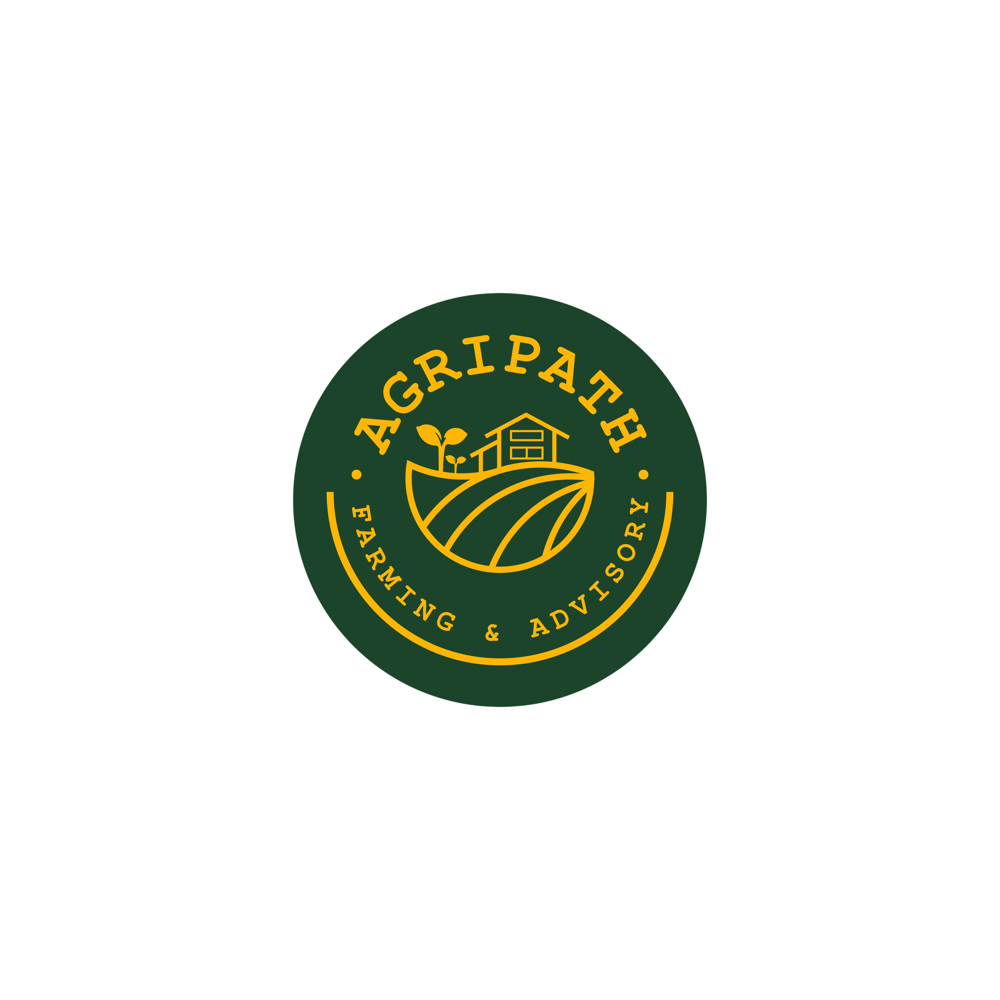

# AgriPath Website

<p align="center">
  
</p>

AgriPath is a modern marketing and conversion website built with Next.js 16 and React 19. The platform connects investors with sustainable agricultural projects in Ghana, offering opportunities to invest in farming while supporting local farmers and contributing to food security.

## Pages

| Route | Description |
|-------|-------------|
| `/` | Homepage with hero, metrics, investment opportunities, and partner sections |
| `/about` | Core values, team members, and partnership information |
| `/investors` | Investor-focused landing with trust signals, how-it-works flow, and payment security |
| `/farmers` | Farmer-focused landing with growth stories, farming process, and farmer profiles |
| `/faqs` | Frequently asked questions and support section |
| `/legal` | Legal information and compliance details |

## Tech Stack

- **Framework:** Next.js 16 (App Router)
- **UI:** React 19, TypeScript 5
- **Styling:** Tailwind CSS 4, PostCSS
- **Animations:** Framer Motion, GSAP
- **Icons:** Lucide React
- **Carousel:** React Slick
- **Linting:** ESLint (Next.js Core Web Vitals + TypeScript)

## Prerequisites

- Node.js >= 18.17
- npm (or your preferred package manager)

## Getting Started

```bash
# Install dependencies
npm install

# Run development server
npm run dev
```

Open [http://localhost:3000](http://localhost:3000) to view the site.

## Scripts

| Script | Description |
|--------|-------------|
| `npm run dev` | Start the development server |
| `npm run build` | Build the application for production |
| `npm run start` | Start the production server |
| `npm run lint` | Run ESLint |

## Project Structure

```
app/
  layout.tsx          # Root layout with SEO metadata, fonts, and schemas
  page.tsx            # Homepage composition
  globals.css         # Global styles and custom effects
  components/         # Shared UI components (Navbar, Footer, Modals)
  sections/           # Reusable page sections (Hero, Metrics, About, etc.)
  about/              # About page route
  farmers/            # Farmers page route
  faqs/               # FAQs page route
  investors/          # Investors page route
  legal/              # Legal page route
fonts/                # Custom font exports
public/               # Static assets
types/                # TypeScript type definitions
```

## Deployment

The application is optimized for deployment on Vercel. For other platforms, run `npm run build` and serve the output from the `.next` directory.

## Environment Variables

Sensitive configuration is managed via `.env` files. These files are gitignored by default.
